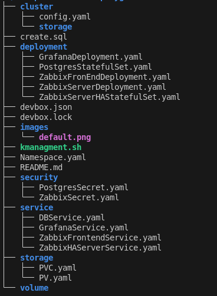
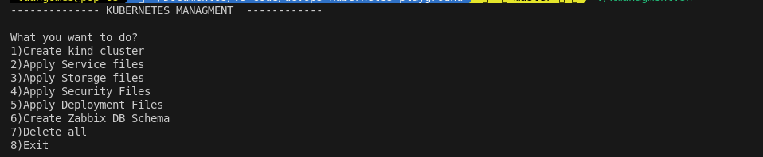

# Kubernetes Management Playground

Este projeto oferece um ambiente automatizado para orquestração de um cluster Kubernetes local, focado no deploy de uma stack de monitoramento composta por **Zabbix Server**, **Zabbix Frontend**, **Grafana** e **PostgreSQL**. O objetivo é facilitar a aprendizagem e experimentação com Kubernetes, utilizando ferramentas modernas como **KIND** e **devbox** para provisionamento e gerenciamento de dependências.

---

## Índice

- [Descrição](#descrição)
- [Tecnologias Utilizadas](#tecnologias-utilizadas)
- [Pré-requisitos](#pré-requisitos)
- [Instalação](#instalação)
- [Como Usar](#como-usar)
- [Funcionalidades do Script](#funcionalidades-do-script)
- [Estrutura do Projeto](#estrutura-do-projeto)
- [Licença](#licença)

---

## Descrição

Este repositório contém um script interativo (`kmanagement.sh`) que automatiza as principais tarefas de gerenciamento de um cluster Kubernetes local, incluindo:

- Criação de cluster com KIND
- Aplicação de arquivos de serviço, storage, segurança e deployment
- Criação do schema do banco de dados para o Zabbix
- Limpeza total do ambiente

O uso do **devbox** garante um ambiente de desenvolvimento isolado e reprodutível, facilitando a instalação de todas as dependências necessárias.

---

## Tecnologias Utilizadas

- [Kubernetes](https://kubernetes.io/)
- [KIND (Kubernetes IN Docker)](https://kind.sigs.k8s.io/)
- [Golang](https://golang.org/)
- [Minikube](https://minikube.sigs.k8s.io/)
- [Zabbix](https://www.zabbix.com/)
- [Grafana](https://grafana.com/)
- [PostgreSQL](https://www.postgresql.org/)
- [devbox](https://www.jetify.com/devbox/)

---

## Pré-requisitos

- **Docker** instalado e em funcionamento
- **git** para clonar o repositório
- **devbox** instalado ([instruções aqui](https://github.com/jetify-com/devbox))
- Permissões de execução para scripts bash

---

## Instalação

1. **Clone o repositório:**
        
    
    `git clone https://github.com/luansantos333 devops-kubernetes-playground.git`
    
    `cd devops-kubernetes-playground`

2. **Abra o shell do devbox para instalar as dependências:**

    `devbox shell`

    *Você pode editar as dependências em `devbox.json` conforme necessário*

3. **Dê permissão de execução ao script:**

    `chmod 771 kmanagement.s`

---

## Como Usar

Execute o script principal e siga as instruções no terminal:

`./kmanagemen.sh`

Você verá um menu interativo com as opções:

- Criar cluster KIND

- Aplicar arquivos de Service

- Aplicar arquivos de Storage

- Aplicar arquivos de Segurança

- Aplicar arquivos de Deployment

- Criar schema do banco Zabbix

- Deletar tudo

- Sair

Escolha a opção desejada e siga as instruções na tela.

---

## Funcionalidades do Script

- **Criação de cluster KIND**: Solicita nome, storage e namespace, e cria o cluster local.
- **Aplicação de arquivos Kubernetes**: Aplica arquivos de Service, Storage (PV/PVC), Secrets, e Deployments com variáveis substituídas dinamicamente.
- **Criação do schema do Zabbix**: Permite executar o script SQL de criação do banco diretamente no pod do PostgreSQL.
- **Limpeza total**: Remove todos os recursos criados (namespace e dependências).
- **Menu interativo**: Facilidade de uso para iniciantes.

---

## Estrutura do Projeto

---

## Licença

Este projeto é open-source e está sob a licença [MIT](LICENSE).

---

## Imagem de Exemplo

---

## Contribuições

Sinta-se à vontade para abrir issues ou pull requests para melhorias, correções ou novas funcionalidades!

---

**Bons estudos e experimentações com Kubernetes! 🚀**